# template-websocket-notifications

A complete WebSocket notification system for pushing real-time events from the backend to browser clients.

---

## Folders

| Folder | Description |
|--------|-------------|
| [`template-websocket-service`](template-websocket-service/README.md) | Serverless backend (Node.js 22, SLS v4) — bridges EventBridge events to WebSocket clients via API Gateway |
| [`template-websocket-mfe`](template-websocket-mfe/README.md) | React micro-frontend (Vite, single-spa) — connects to the service, displays live events |
| [`template-websocket-demo`](template-websocket-demo/README.md) | End-to-end demo — deploys all infrastructure and hosts the MFE on S3 + CloudFront from a single terminal, with an interactive CLI runner |

> **Requires `aws-lambda-stream` v1.2.0 or later.** The WebSocket pipeline handlers (`toConnections`, `toMessage`, `wsConnect`, `wsDisconnect`, `wsReplay`, `wsSubscribeWrite`, `wsSubscribeDelete`) were introduced in that release.

---

## Purpose

A lightweight real-time push channel from backend services to browser clients. Any backend event published to EventBridge can be delivered to subscribed WebSocket connections within sub-second latency, with no polling, no per-user queues, and no frontend infrastructure beyond a single React hook.

---

## Use cases

### Async job completion

An MFE kicks off a long-running backend operation and needs to know when it's done.

- An optimization job completes
- A validation job finishes processing
- A bulk import/export operation is ready for download

### Live notifications

Multiple users need to be informed of something in real time.

- Alerts, warnings, or system announcements pushed to all connected users
- A record was updated by another user and open viewers should be notified
- Operational status changes that require immediate attention

---

## How it differs from an SQS + SNS polling approach

An alternative architecture uses per-user SQS queues subscribed to SNS topics, with the frontend long-polling each queue. That approach is designed for **continuous high-volume data sync**.

This WebSocket approach is designed for **sparse operational notifications** where simplicity and low latency matter more than durability.

| | WebSocket Notifications (this) | SQS + SNS Polling |
|---|---|---|
| **Use case** | Job done, status change, one-off alerts | Continuous data sync |
| **Latency** | Sub-second | 1–5 seconds |
| **Message durability** | TTL window only (configurable, default 30 min) | Queued until consumed |
| **Per-client filtering** | SubscriptionsTable (server-side) | SNS filter policies |
| **Infrastructure** | 3 DynamoDB tables + API GW WebSocket + Lambda | Per-user SQS queues + SNS + cleanup jobs |
| **Ops overhead** | TTL handles all cleanup | Cleanup jobs + multi-region queue management |
| **Multi-region** | EventBridge cross-region forwarding | Multi-region SQS replication |
| **Cost model** | Pay per message + connection-minutes | Pay per SQS poll request (constant) |
| **FE integration** | Single `useWebSocket` hook | Polling worker + client-side data management |

**Rule of thumb:** If you need data to flow continuously into the frontend for queries and rendering, an SQS + SNS approach may be more appropriate. If you need to notify the UI that something happened, use this.

---

## Architecture

```
┌─────────────────────────────────────────────────────────────────────────┐
│                        Backend (per region)                             │
│                                                                         │
│  EventBridge ──────► broadcast Lambda (aws-lambda-stream)               │
│  (detail-type:       │                                                  │
│   thing-updated)     ├─► query SubscriptionsTable (type + catch-all *)  │
│                      │       └─► push to each matched connection        │
│                      └─► persist to EventsTable (TTL 30 min)            │
│                                                                         │
│  EventBridge ──────► CrossRegionForwardRule ──► other region bus        │
│                                                                         │
│  Client $connect ──► connect Lambda                                     │
│  ?subscribe=         ├─► write ConnectionsTable                         │
│   thing-updated      └─► write SubscriptionsTable (one row per type)    │
│                                                                         │
│  ws.onopen ────────► replay Lambda { action: 'replay', since }          │
│  (replay: true only)  └─► query EventsTable → push missed events        │
│                                                                         │
│  Sub change ────────► subscribe Lambda { action: 'subscribe',           │
│  (live resub)         |                  eventTypes: [...] }            │
│                       ├─► delete old subscriptions for connectionId     │
│                       └─► write new SubscriptionsTable rows             │
│                                                                         │
│  Client $disconnect ► disconnect Lambda                                 │
│                       ├─► delete ConnectionsTable                       │
│                       └─► delete SubscriptionsTable (all for this conn) │
└─────────────────────────────────────────────────────────────────────────┘

┌─────────────────────────────────────────────────────────────────────────┐
│                        Frontend (MFE)                                   │
│                                                                         │
│  useWebSocket hook                                                      │
│    ├─► opens wss://{url}?subscribe=thing-updated                        │
│    ├─► on open: sends { action: 'replay', since } if replay: true       │
│    ├─► on sub change: sends { action: 'subscribe', eventTypes }         │
│    ├─► receives pushed events in real time                              │
│    └─► auto-reconnects with exponential backoff on drop                 │
└─────────────────────────────────────────────────────────────────────────┘
```

---

## Events Flow

### CONNECT
<p align="center">
  
  <br />
  <span style="font-size: 0.8em; font-style: italic;">The browser opens a WebSocket connection.<br/>
  API Gateway triggers the Connect Lambda, which writes the connection ID and its subscriptions into DynamoDB.</span>
</p>

---

### SUBSCRIBE
<p align="center">
  
  <br />
  <span style="font-size: 0.8em; font-style: italic;">The client sends a <code>{ action: 'subscribe', eventTypes: [...] }</code> message over an existing connection.<br/>
  API Gateway triggers the Subscribe Lambda, which deletes the connection's old subscription rows then writes the new ones.</span>
</p>

---

### BROADCAST
<p align="center">
  
  <br />
  <span style="font-size: 0.8em; font-style: italic;">A backend service publishes an event to EventBridge.<br/>
  The Broadcast Lambda is triggered, queries the Subscriptions Table for all matching connections,<br/>
  then calls the API Gateway Management API to push the event to each connected browser.</span>
</p>

---

### REPLAY
<div align="center">
  
  <br />
  <div style="font-size: 0.8em; font-style: italic;">On reconnect the browser sends <code>{ action: 'replay', since }</code>.<br/>API Gateway triggers the Replay Lambda, which queries the Events Table for events newer than <code>since</code>,<br/>
  then pushes each one back through the WebSocket to the browser.</div>
</div>

---

### DISCONNECT
<p align="center">
  
  <br />
  <span style="font-size: 0.8em; font-style: italic;">The browser closes the WebSocket connection. API Gateway triggers the Disconnect Lambda,<br/>
  which simultaneously deletes the connection record from the Connections Table<br/>
  and removes all subscription rows for that connection from the Subscriptions Table.</span>
</p>

---

## Publishing events from your backend

Any Lambda in your system can trigger a WebSocket notification by publishing to the EventBridge bus:

```js
import { publishToEventBridge } from 'aws-lambda-stream';

// In your pipeline rule:
{
  id: 'notifyCompletion',
  flavor: cdc,
  eventType: 'job-completed',
  toEvent: (uow) => ({
    type: 'job-completed',
    id: uow.event.id,
    tags: { region: process.env.AWS_REGION },
    result: uow.event.result,
  }),
}
```

Include `tags.region` in all published events if you plan to enable multi-region — the cross-region forward rules use it to prevent forwarding loops.

---

## What this is NOT

- Not a replacement for an SQS + SNS polling system — use that for continuous data sync
- Not a message queue — if the TTL window expires, events are gone
- Not for high-frequency data updates — designed for sparse notifications
- Not for sensitive data without additional auth validation at `$connect` time

---

## Going further

- [template-websocket-service/README.md](template-websocket-service/README.md) — Lambda functions, DynamoDB schema, subscription semantics, multi-region setup, deployment
- [template-websocket-mfe/README.md](template-websocket-mfe/README.md) — hook API, components, Vite config, single-spa integration
- [template-websocket-demo/README.md](template-websocket-demo/README.md) — end-to-end walkthrough, interactive demo runner, S3 + CloudFront MFE hosting, cleanup

